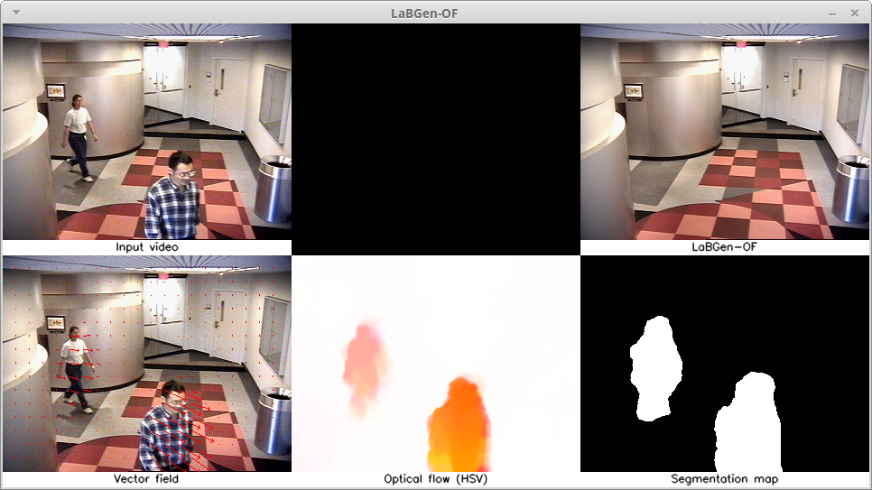

# LaBGen-OF

[](https://travis-ci.org/benlaug/labgen-of)

LaBGen-OF is a patch-based stationary background generation method introduced in a paper submitted to ACIVS 2017, and based on [LaBGen](https://github.com/benlaug/labgen). The purpose of this repository is twofold:

1. To share the source code of the method.
2. To embed the method in a ready-to-use program.


## Compiling the program

The program implementing the method has been developed in C++11 and is distributed under the [GPLv3](LICENSE) license. In order to compile it, you need a modern C++ compiler, a copy of the [Boost](http://www.boost.org) library, a copy of the [OpenCV 3](http://opencv.org) library *with the contrib modules*, and the [CMake](https://cmake.org) build automation tool. On UNIX-like environments, the program can be compiled as follows, considering that your terminal is in the source code directory:

```
$ cd build
$ cmake -DCMAKE_BUILD_TYPE=Release ..
$ make
```

## Running the program

Once the program has been compiled, the following command gives the complete list of available options:

```
$ ./LaBGen-OF-cli -h
```

In this program, the syntax used to provide the path of the input video sequence is the same one used by the OpenCV library. Thus, for instance, one can generate a stationary background image for the IBMtest2 sequence of the [SBI dataset](http://sbmi2015.na.icar.cnr.it/SBIdataset.html) [[1](#references)] with *(A, S, N, P, T) = (DeepFlow, 119, 8, 3, 0.04)* as follows:

```
$ ./LaBGen-OF-cli -i path_to_IBMtest2/IBMtest2_%6d.png -o my_output_path -a deep_flow -s 119 -n 8 -p 3 -t 4
```

The following strings are accepted with the `-a` option: `deep_flow`, `sparse_to_dense` (Lucas-Kanade), `dis_flow`, `farneback`, `simple_flow`, `dual_tvl1`. One can directly use the default set of parameters with the `-d` option:

```
$ ./LaBGen-OF-cli -i path_to_IBMtest2/IBMtest2_%6d.png -o my_output_path -d
```

One can observe the processing performed by LaBGen-OF in graphical windows by adding the `-v` option:

```
$ ./LaBGen-OF-cli -i path_to_IBMtest2/IBMtest2_%6d.png -o my_output_path -d -v
```

With this last option, the processing will be slower as an estimation of the stationary background is generated after each frame in the corresponding window. Here is an example of the execution of the program with the `-v` option:



By default, all the items to observe are gathered in a unique window. If, for any reason, a graphical window per item is required, one can add the `-l` option along with `-v`:


Finally, one can use the `-w` option to define (in ms) the time to wait between the processing of two frames when the visualization is enabled. This time is given to the `waitKey()` function of OpenCV. Consequently, the option `-w 0` means that you have to press any key to process the next frame. By default, the time is defined to 1 ms.

## Citation

If you use LaBGen-OF in your work, please cite this webpage as long as the corresponding paper is not published.

## Alternatives

* The original version of LaBGen is [available on GitHub](https://github.com/benlaug/labgen).
* A pixel-level variant of LaBGen, called LaBGen-P, is also [available on GitHub](https://github.com/benlaug/labgen-p).

## Testing

Each commited revision is automatically tested using [Travis CI](https://travis-ci.org/benlaug/labgen-of) on:

* Ubuntu 14.04 with the `g++` compiler and OpenCV 2.3 installed from the Ubuntu repositories.
* Ubuntu 14.04 with the `g++` compiler and OpenCV 3.2 compiled from the sources.
* OS X El Capitan with the `clang++` compiler and OpenCV 2.4 installed with [Homebrew](https://brew.sh).
* OS X El Capitan with the `clang++` compiler and OpenCV 3.2 installed with [Homebrew](https://brew.sh).

## References

[1] L. Maddalena, A. Petrosino. Towards Benchmarking Scene Background Initialization. *International Conference on Image Analysis and Processing Workshops (ICIAP Workshops)*, 9281:469-476, 2015.
